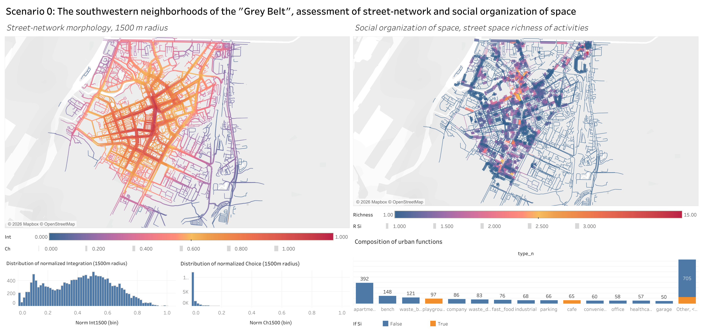

# Former industrial neighborhoods of St. Petersburg: assessing relationship between street-network morphology and social organization of space. 
*Developed by Bereiya Said, 2nd year master student of IDU ITMO*
## Introduction ##
More often than not former industrial districts of USA and Europe experience the consequences of being "left-behind". "Left-behindness" entails a variety of socio-spatial externalities such as physical deterioration of infrastructure, an increased social tension among its residents, stigmatization of space. These are what an American geographer Ed Soja called "metropolarities", giving rise to all kinds of social and spatial paradoxes. To initiate a more evidence-based regeneration projects and policy for these areas, a deep understanding of the exisitng space-society relationships is required. It is in the scope of this thesis to identify and characterise the forms of (paradoxical) relationships between the morphological configuration and social organization of space in the former industrial areas. The street-network, and a street as its element, is taken as an object, allowing for porous movement between a micro-level and a meso-level scale of an analysis. The city of interest is St. Petersburg (Russia) which has an immense territory of previous industrial use now referred to as "Gray Belt". The theoretical foundation is the research movement dubbed "Spatial Cultures," which emerged under the influence of Émile Durkheim’s sociology and the Space Syntax theory of Hillier and Hanson.

## The Block-Scheme of the developed method ##
Street-network morphology via Space Syntax is taken for the  and its key measures of Integration and Choice. Whereas, the social organization is uderstood as a pattern of streets' functionality across the neighborhood. The operationalization for the social organization is done via a diveristy metric, showing how diverse and dense the functional uses of each street's segment.  

<p align="center">
  
</p>
<p align= "center"> *The block-scheme of the method, author: Bereiya Said 2nd year master student of IDU ITMO* </p>


## The  ## 
The main ETL-algorithms are packed in the library "streets_syntax_social" (installation instructions below)
The key function of the method is "streets_social_sdataset". Taking a street-network with morphological values and the urban functions (points), it builds a geo-dataset of street segmetns (LineString) with columns containing the syntactic and functional diversity metrics. Depending on the parameters set by a user, the number of characteristical columns may vary from four up to thirty. The results    

calculation, analysis, visualization and modeling of the (spatial) relationships between street-nework morphology and social organization of space in the context of former industrial neighborhoods of Saint Petersburg. 
The method functions across 3 notebooks: 
1. 'Street_space_diversity_metrics.ipynb': the code estimates the intensity of each street's (segement's) use and provides an evidence of a street's social role in the neighborhood by calculating Shannon-Wiener index as a key metric, as well as two additional ones (Richness Berger-Parker indecies). The section concludes with histograms of distributions for each variable. 
2. "SSM-Diversity Relationship.ipynb" (amending): the relationship between the urban functions and the morphological qualities is studied. It measures the spatial autocorrelation (global and local Moran's I) of each variable.
3. "Rebalancing Social Life" (IN DEVELOPMENT): provides a flexible analytical tool to rebalance the instensity of social life (as proxied with diversity) across the neighborhood according to the morphological qualities of a street. 

The method may be adopted more broadly in the analysis of other cities and other type of districts. Yet, the initial hypotheses as to what type of relationships are more likely to take place in the area of study is a helpful prerequisite to the analysis and modeling. 


## Method installation ##
In order to install the package, containng the method use python environmnent such as Colab, Jupeter Notebooks. 

Firstly, clone the repo:
``` 
!git clone https://github.com/saidfreeds13/Theiss_package/
```
Secondly, install the git package:
```
!pip install git+https://github.com/saidfreeds13/Theiss_package.git
```
Thirdly, install the package:
```
!pip install theiss-package
```
Fourthly, import the method:
```
import streets_syntax_social 
```


## Experimental application ##

## Intermediate results ##
<p align="center">
  
</p>
---
